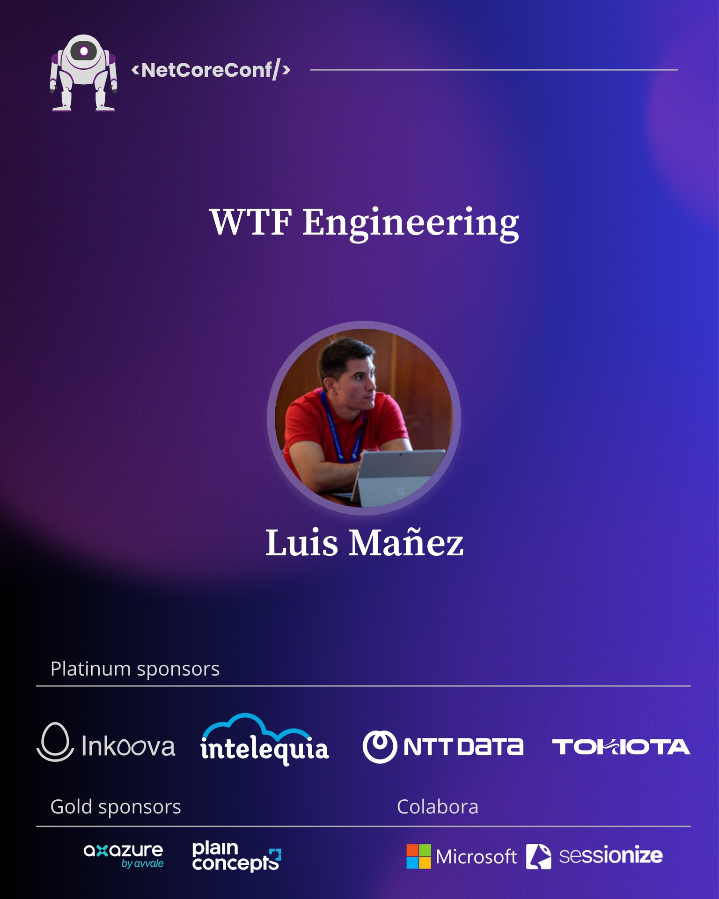

# WTF Engineering

This repository contains the materials, demos, and resources used during the session **WTF Engineering** delivered during the NetCoreConf Madrid 2026 (23 October 2026).



## 📝 Abstract

¿Cansado de que cada semana aparezca un nuevo «random string» engineering? Seguramente has oído hablar de Prompt Engineering, Context Engineering... Loop Engineering... ¡Oh, otro más! Graph Engineering... y mi favorito: Harness Engineering. Si es el caso, vente a esta sesión. Pondremos orden en todo esto, veremos qué aporta cada concepto, cuándo tiene sentido y profundizaremos en Harness Engineering y en cómo Microsoft Agent Framework nos lo pone fácil a la hora de montar nuestro propio harness.

## 📚 Repository contents

- [`slides`](./slides) — Presentation slides
- [`src`](./src) — Source code and demos
- [`docs`](./docs) — Additional documentation and supporting material
- [`assets`](./assets) — Images and other session assets

## 🚀 About this session

### Demo quick start

Install the .NET 10 SDK, then run these commands from the repository root:

```bash
cp env.template .env
```

Fill in `FOUNDRY_PROJECT_ENDPOINT` and `FOUNDRY_MODEL` in `.env`. The template leaves all values empty; optional OTLP settings have local defaults. Process environment variables override `.env`.

```bash
dotnet restore src/WftEngineering.slnx --locked-mode
dotnet build src/WftEngineering.slnx -c Release --no-restore
dotnet test src/WftEngineering.slnx -c Release --no-build --no-restore
dotnet run --project src/WftEngineering.Demo -c Release --no-build
```

The current scaffold displays the startup screen and validates configuration. The agent workflow is planned in the [feature specifications](docs/specs/features/README.md). See [scaffolding setup and verification](docs/specs/scaffolding.md) for details.

This repository is intended to accompany the live session and provide attendees with access to the code, examples, and resources discussed during the presentation.

Feel free to explore the demos, reuse the examples, and open an issue if you find something that could be improved.

## 👨‍💻 Author

**Luis Mañez**

- GitHub: [Luis Mañez](https://github.com/luismanez)
- Microsoft Foundry MVP
- Chief Architect @ [ClearPeople](https://www.clearpeople.com/)

## ❤️ Supported by ClearPeople

My participation in community events and conferences is supported by **ClearPeople**.

Learn more about ClearPeople at [clearpeople.com](https://www.clearpeople.com/).

## 📄 License

Unless otherwise stated, the source code in this repository is available under the terms of the repository license.
