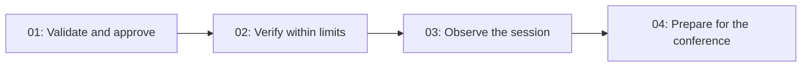

# Implementation plan: Production Change Assistant

**Verification policy:** this conference demo has no automated tests, testing project/dependencies, or scripted model client. This explicit presenter decision applies to all later implementation prompts. For the combined F2–F4 request, verification is code inspection and compilation only; the presenter explicitly owns all Foundry/Aspire E2E and rehearsal. Do not run those checks or add testing infrastructure.

Functional source of truth: [demo spec](../production-change-demo.md). This plan breaks down its implementation; it does not change its decisions or create application code.

Feature plans and task lists live in `docs/specs/features/<feature>/`. There is no duplicate plan in `tasks/`. Each `todo.md` is the sole work checklist for its feature. Write all specification and implementation documentation in English.

[Scaffolding](../scaffolding.md) is implemented: .NET 10, `.env`, typed settings, built-in DI, Spectre.Console, with a single console project. Features 01–04 are implemented and compile. F1 has [historical compatibility evidence](01-governed-production-change/compatibility.md); current compilation and pending presenter checks are in [rehearsal.md](04-conference-scenarios/rehearsal.md). Use the [runbook](../../demo-runbook.md) for the complete demo. All code projects live under `src/`.

## Features and implementation order

| Order / stable ID | Outcome on completion | Dependency | Documents |
|---|---|---|---|
| `01-governed-production-change` | The console loads the Skill, validates the change and health, displays tasks, and starts the fake only after native human approval. Rejection and failed preconditions leave zero deployments. | None | [Plan and prompt](01-governed-production-change/plan.md) · [Tasks](01-governed-production-change/todo.md) |
| `02-bounded-deployment-verification` | The harness invokes the agent again while evidence is missing, shows Running/Running/Succeeded in distinct iterations, verifies subsequent health, and stops on success, failure, or a limit. | `01-governed-production-change` | [Plan and prompt](02-bounded-deployment-verification/plan.md) · [Tasks](02-bounded-deployment-verification/todo.md) |
| `03-observable-demo-session` | The complete session can be followed in the console and an Aspire trace, including approval, iterations, and outcome, without capturing sensitive content. | `02-bounded-deployment-verification` | [Plan and prompt](03-observable-demo-session/plan.md) · [Tasks](03-observable-demo-session/todo.md) |
| `04-conference-scenarios` | The presenter has runnable scenarios, reproducible commands, and a demo script with rehearsal evidence. | `03-observable-demo-session` | [Plan and prompt](04-conference-scenarios/plan.md) · [Tasks](04-conference-scenarios/todo.md) |

Each feature groups a demonstrable capability, with three internal tasks and one implementation prompt. Tasks are steps within the same session, not separate requests to the user. F1's intermediate outcome is a deployment that has started and awaits verification; F2 adds the flow through Completed.

## How to implement a feature with one prompt

Copy the prompt from its `plan.md`. The agent reads the global spec, the feature plan, and its `todo.md`, checks dependencies, and completes the authorized scope with compilation and documentation. E2E/rehearsal is assigned to the presenter. A combined request may authorize subsequent features in order; do not reorganize the architecture or create sub-agents.

The planning request authorizes preparation of these documents. Implementation begins with a subsequent request to implement a feature. Feature folders contain documentation; code belongs in `src/`, as specified in the spec.

## Shared contracts

- **Request:** a typed `RequestedChange`, retained by the host, with change, service, version, and environment. The text sent to the model is constructed from that target; it does not contain preloaded approval or health.
- **Store:** one `DemoDeploymentStore` per run. Records, enums, scenarios, and evidence stay in that file; avoid a new layer for every concept.
- **Tools:** `GetChangeRequest`, `GetServiceHealth`, `DeployService`, and, from F2, `GetDeploymentStatus`. Only deployment produces a business side effect.
- **Approval:** `ApprovalRequiredAIFunction`, `ToolApprovalRequestContent`, `CreateResponse`, and the same `AgentSession`. No permission comes from the model.
- **State:** separate store facts, progress declared by `TodoProvider`, and agent messages. Only operational evidence determines Completed.
- **Loop:** a single `DelegateLoopEvaluator`; `MaxIterations = 4` per loop run, `MaximumIterationsPerRequest = 12` for function calling, and no autonomous restart when the budget is exhausted.
- **Instrumentation:** F1 and F2 add activities/events as each operation is introduced. F3 connects the exporter; the presenter verifies the complete session in the viewer. The shared source is `WftEngineering.Demo`; sensitive content capture is disabled from the start.

Keep DI and harness composition visible in `Program.cs`, typed configuration in `DemoSettings.cs`, and the Spectre.Console presentation/session flow in `DemoApplication.cs`. Future tool implementation belongs in `DeploymentTools.cs` and data in `DemoDeploymentStore.cs`. Copy the Skill to the output directory and resolve it from `AppContext.BaseDirectory`. Keep web, file memory, modes, and compaction disabled; do not enable scripts, shell, MCP, CodeAct, file access, or background agents.

## Spec coverage

| Requirement / spec section | Delivering feature | Main verification |
|---|---|---|
| Architecture and versions (§2–3) | F1; final freeze in F4 | Restore/build, SDK, and lock files |
| Prompt, context, and Skills (§4) | F1; verification procedure extended in F2 | Skill loaded and data obtained through tools |
| Approval and authorization (§4–5) | F1; regression when integrating the loop in F2 | Zero side effects before acceptance; binding and guards |
| Todos and session state (§4–5) | F1; verification progress in F2; final presentation in F3 | Same session, provider reads, and independent operational success |
| Fake, idempotency, and health (§5) | F1–F2 | Guard review and subsequent evidence |
| Conceptual graph and branches (§6) | F2; visible scenarios in F4 | Success, rejection, failure, and pending work |
| Loop and limits (§6) | F2 | One new observation per iteration; no fifth run |
| OpenTelemetry and privacy (§7) | F1–F2 instrumentation; F3 export | Correlated trace and absence of sensitive content |
| Commands and acceptance criteria (§8–9) | Each feature; complete walkthrough in F4 | Compilation and manual rehearsal |
| Slides, live demo, and simplification (§10–11) | F3–F4 | Seven code elements easy to locate and a 12-minute script |
| Outstanding compatibility / model checks (§12) | F1 and F4 rehearsal | Actual evidence, without treating pending checks as passed |

## Verification and continuity between prompts

Each task edits approximately five files at most; lock files generated by restore are recorded separately. Checkpoints occur after the second task and at feature completion. Review guards alongside the behavior they protect; do not add testing infrastructure.

At feature completion, update its `todo.md` with commands, results, and limitations. Check a box only when evidence exists. The business fake simulates the external deployment system; inference always uses the configured Foundry model.

The Foundry endpoint/model, an identity with access, .NET 10 SDK, and Docker for the dashboard are inputs to the implementation/rehearsal environment. They are not needed to write this plan. If credentials are missing, complete the build and source review and record the live rehearsal as pending; do not provision infrastructure or invent results.

Parallel implementation is not planned: all features modify `Program.cs` and shared state. The presenter authorized features 02–04 in one prompt, executed sequentially with a build checkpoint per feature. No sub-agents were used.

## Risks to resolve early

| Risk | Timing and mitigation |
|---|---|
| Differences between the pinned package and documentation | First step of F1: check signatures, compile, and adjust the spec before relying on them |
| Approval becomes unsafe when looping is introduced | F2 reviews native rejection, binding, and guards |
| Polling is consumed within a single run | F2 reviews snapshot caching and manually observes invocation counts |
| Todos or responses suggest success without evidence | F1 separates state sources; F2 keeps operational completion independent of declared progress |
| Console introduces too much architecture | Review after each feature: a small console project with concrete services, without extra application layers or a TUI |
| Live dependencies are unavailable during rehearsal | F4 records pending checks and prepares a backup labeled as recorded |
