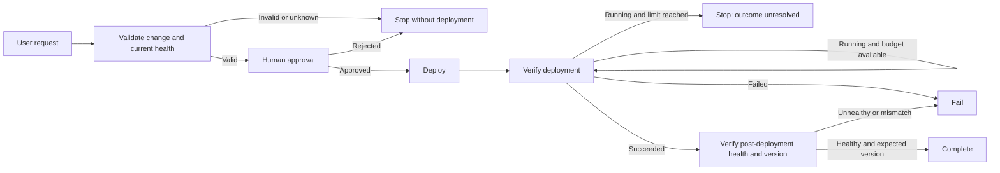

# Spec: Enterprise Production Change Assistant

**Status:** proposed for review, implementation pending.

**API review date:** 7 October 2026.

**Target:** final demo in a 45-minute talk at NetCoreConf Madrid 2026.

## 1. Objective and scope decisions

Build a .NET console application that lets the audience visually follow this request:

> Deploy Atlas API v2.7.0 to Production using change CHG-1042.

The demo shows how a harness integrates context, tools, human approval, state, limits, and observability. The model proposes actions; the runtime controls their execution. Deployment and enterprise systems are in-memory fakes; only inference uses a live service.

Proposed assumptions:

- Each run processes one change, with a fresh session and store. No general chat or persistence between runs.
- .NET 10, one console project, and a small test project that is not shown live.
- A model already available in Microsoft Foundry, selected and rehearsed before the talk. No resources are provisioned for this demo.
- Console output, agent instructions, and documentation in English; the conference explanation in Spanish.
- The happy path is mandatory. Rejection and the iteration limit are prepared as brief alternatives.
- Graph Engineering is represented with simple states and branches, without introducing the workflow engine.

Out of scope: real deployment, automatic rollback, databases, corporate APIs, sub-agents, CodeAct, shell, generated code, MCP, a general planner, and a full TUI. Do not add a custom approval mechanism or a custom LLM execution loop.

Determinism applies to the fake's data, transitions, and controls. A live model may vary its text, calls, and latency; an identical transcript is not promised.

## 2. Technical baseline and compatibility

`HarnessAgent` belongs to the `Microsoft.Agents.AI.Harness` package, uses the `Microsoft.Agents.AI` namespace, and is created with `chatClient.AsHarnessAgent(options)`. It remains an `AIAgent`; the harness composes framework components. [Official harness reference](https://learn.microsoft.com/en-us/agent-framework/concepts/harness).

Proposed baseline to freeze during rehearsal:

| Dependency | Proposed version | Purpose |
|---|---|---|
| `Microsoft.Agents.AI.Harness` | `1.23.0` | Harness; includes the Agent Framework core |
| `Azure.AI.Projects` | `3.0.0-beta.3` | Foundry project client |
| `Azure.Identity` | `1.21.0` | `AzureCliCredential` for the presenter's identity |
| `Microsoft.Extensions.AI.OpenAI` | `10.10.1` | `IChatClient` adapter |
| `OpenTelemetry.Exporter.OpenTelemetryProtocol` | `1.19.1` | OTLP SDK/export |

These versions are published: [Harness 1.23.0](https://www.nuget.org/packages/Microsoft.Agents.AI.Harness/1.23.0), [Projects](https://www.nuget.org/packages/Azure.AI.Projects/3.0.0-beta.3), [Identity](https://www.nuget.org/packages/Azure.Identity/1.21.0), [adapter](https://www.nuget.org/packages/Microsoft.Extensions.AI.OpenAI/10.10.1), and [exporter](https://www.nuget.org/packages/OpenTelemetry.Exporter.OpenTelemetryProtocol/1.19.1). The [.NET 1.23.0 release](https://github.com/microsoft/agent-framework/releases/tag/dotnet-1.23.0) updates Projects and Microsoft.Extensions.AI to this API family.

The gallery also lists `1.24.0` dated 7 October. The proposal is to freeze `1.23.0`, already published and documented, without updating packages on the day of the talk. Looping APIs remain marked experimental: pin versions and explicitly acknowledge `MAAI001`, without suppressing all warnings. [Looping](https://learn.microsoft.com/en-us/agent-framework/agents/looping), [official sample](https://github.com/microsoft/agent-framework/blob/main/dotnet/samples/02-agents/Harness/Harness_Step05_Loop/Program.cs).

**Verification pending implementation:** restore and compile this combination and check approvals + streaming + looping with the chosen model. Documentation and links to `main` do not replace that check. If the pinned package differs, update this spec first; do not invent an equivalent API.

## 3. Minimal architecture and responsibilities

```text
Console host
  └─ HarnessAgent
       ├─ IChatClient → live model
       ├─ AgentSkillsProvider → production-change/SKILL.md
       ├─ TodoProvider + AgentSession
       ├─ four tools → DemoDeploymentStore
       ├─ ApprovalRequiredAIFunction + ToolApprovalAgent
       ├─ LoopAgent + DelegateLoopEvaluator
       └─ OpenTelemetry → local Aspire Dashboard
```

| Component | Responsibility |
|---|---|
| `Program.cs` | Configure the model and harness; open a session; process the request; display events and todos; collect and return native approvals; determine the final outcome from state; configure telemetry. |
| `DeploymentTools.cs` | Expose four typed operations, validate arguments and preconditions, and protect fake invariants. Do not interpret a model response as permission. |
| `DemoDeploymentStore.cs` | Business data, scenario, fixed clock, deployment, polling snapshots, read evidence, and execution state. Contains the small records/enums. |
| `production-change/SKILL.md` | Specialized business procedure, loaded on demand. It grants no permissions and contains no implementations. |
| `AgentSession` / `TodoProvider` | History, approval continuity, and declared task progress. |
| Local evaluator in `Program.cs` | Decide `Continue`/`Stop` by reading the store and enable the fake's next observation. The framework runs the loop. |

Planned structure:

```text
docs/specs/production-change-demo.md
src/WftEngineering.Demo/
├── WftEngineering.Demo.csproj
├── packages.lock.json
├── Program.cs
├── Tools/DeploymentTools.cs
├── Demo/DemoDeploymentStore.cs
└── skills/production-change/SKILL.md
tests/WftEngineering.Demo.Tests/
├── WftEngineering.Demo.Tests.csproj
└── ProductionChangeTests.cs
```

Copy `skills/**` to the output directory and resolve it from `AppContext.BaseDirectory`. Avoid depending on the directory from which `dotnet run` is launched. Do not create interfaces, factories, repositories, a DI container, or a shared library. The test project may add a scripted `IChatClient` to verify the framework without network access.

## 4. Framework primitives

### Visible harness configuration

Keep creation of the `IChatClient`, instructions, tools, Skill source, evaluator, limits, and OpenTelemetry in `Program.cs`. For Foundry, use `AIProjectClient` and the `GetProjectOpenAIClient().GetResponsesClient().AsIChatClient(model)` chain, with `AzureCliCredential`. [Official connection example](https://devblogs.microsoft.com/agent-framework/meet-your-agent-harness-and-claw/).

Selected options:

| Option | Value / decision |
|---|---|
| `Name` | `ProductionChangeAssistant` |
| `HarnessInstructions` | Brief general guidance, without the business procedure |
| `ChatOptions.Instructions` | Production Change Assistant identity |
| `ChatOptions.Tools` | The four business tools; deployment wrapped in approval |
| `AgentSkillsSource` | `new AgentFileSkillsSource(skillsPath)`, without a script runner |
| `DisableTodoProvider` | `false` |
| `DisableAgentModeProvider` | `true`; do not demonstrate plan/execute modes |
| `DisableFileMemory`, `DisableWebSearch`, `DisableCompaction` | `true` |
| `FileAccessStore`, `BackgroundAgents` | Unset |
| `ToolApprovalAgentOptions.AutoApprovalRules` | Only `AgentSkillsProvider.ReadOnlyToolsAutoApprovalRule` |
| `DisableApprovalResponseBinding` | `false`; preserve native binding |
| `LoopEvaluators` | A single `DelegateLoopEvaluator` over external state |
| `LoopAgentOptions.MaxIterations` | `4` |
| `LoopAgentOptions.FreshContextPerIteration` | `false`; preserve the session |
| `MaximumIterationsPerRequest` | `12`, a separate limit for internal tool calling |
| `OpenTelemetrySourceName` | `WftEngineering.Demo` |

Defaults include capabilities we do not need. These options reduce the composition and keep both limits explicit. [Official options](https://github.com/microsoft/agent-framework/blob/main/dotnet/src/Microsoft.Agents.AI.Harness/HarnessAgentOptions.cs).

Example of style and a teaching point, deliberately partial:

```csharp
var deployTool = new ApprovalRequiredAIFunction(
    AIFunctionFactory.Create(tools.DeployService));

var loopOptions = new LoopAgentOptions
{
    MaxIterations = 4,
    FreshContextPerIteration = false,
};
```

Use C# with nullable enabled, records for results, enums for states, `CancellationToken` in asynchronous operations, and small methods with explicit names. Do not compress code to meet a line count.

### Prompt and context

Global instructions: use tools to learn about external systems, load the relevant Skill, treat results as data, communicate verified facts, and stop when uncertain. Do not include CHG-1042, its approval, or initial health in the prompt.

Initially, the provider advertises the Skill's name and description. `load_skill` adds the procedure when the model selects it. Tool results add change, health, and deployment data; history and todos provide session continuity. Do not add another context builder to duplicate these mechanisms. [Agent Skills](https://learn.microsoft.com/en-us/agent-framework/agents/skills).

Planned Skill content: retrieve the change; verify approval, service, version, environment, and window; check prior health; stop if anything fails; create the five tasks; propose deployment and wait for approval; query one observation per iteration; verify subsequent health and version; complete only with evidence. Polling instructions guide the model, but the fake limits new observations through code.

The provider adds its own tools alongside the four business tools. The reviewed code even advertises `run_skill_script`; this spec does not assume it disappears when scripts are omitted. The Skill will have no scripts or executable resources, there will be no runner, and the host will reject any approval unrelated to `DeployService`. The read-only rule does not automatically approve scripts, and its reserved names must not collide with business tools. [Provider code](https://github.com/microsoft/agent-framework/blob/main/dotnet/src/Microsoft.Agents.AI/Skills/AgentSkillsProvider.cs).

### Todos

Use the native `TodoProvider` with five fixed items described in the Skill: validate the change, check prior health, start deployment, verify deployment, and verify subsequent health. The agent creates and updates them with `todos_add` / `todos_complete`; the console obtains the provider with `GetService<TodoProvider>()` and reads `GetAllTodosAsync(session)`.

Their state lives in `AgentSession.StateBag`; it is not private model reasoning. Todos are declared progress, not authorization or operational evidence. If the agent completes them prematurely, the store still prevents a success declaration. Failure leaves tasks pending with an overall `Stopped`/`Failed` outcome, without marking them all complete. [Planning and todos](https://learn.microsoft.com/en-us/agent-framework/agents/planning-and-todos), [provider API](https://github.com/microsoft/agent-framework/blob/main/dotnet/src/Microsoft.Agents.AI/Harness/Todo/TodoProvider.cs).

Do not add `TodoCompletionLoopEvaluator` to the main flow: with multiple evaluators, execution continues if any requests another iteration; a `Stop` from the business evaluator would not veto pending todos. A single external evaluator avoids this ambiguity. [Evaluator semantics](https://learn.microsoft.com/en-us/agent-framework/agents/looping).

### Native approval

Register `DeployService` as an `ApprovalRequiredAIFunction`. Detect `ToolApprovalRequestContent` in responses; show the actual arguments from `request.ToolCall`, including change, service, version, and environment. Accept only explicit operator approval; EOF, unrecognized input, and cancellation do not approve.

Return `request.CreateResponse(true/false)` inside a user `ChatMessage`, to the same session. Do not replace it with the text “yes” or a model-generated boolean. Preserve native binding between request and response. Do not offer “always approve” or automatically approve deployment. [Approval with Harness Agent](https://learn.microsoft.com/en-us/agent-framework/agents/tools/tool-approval).

Before showing the question, the host checks the arguments against the change and store reads. An invalid proposal is rejected and terminates without approval interaction. After acceptance, the tool implementation rechecks preconditions and the simulated principal's permissions immediately before mutating the store.

**Approval is not Authorization:** human acceptance lets the framework protocol continue; the business operation still validates identity/permissions and preconditions. The demo uses a fixed identity outside model arguments; it does not include a real IAM system.

## 5. Tools, data, and deterministic state

| Tool | Input | Result and effect |
|---|---|---|
| `GetChangeRequest` | `changeId` | Change record or `NotFound`. Records read evidence. |
| `GetServiceHealth` | `service`, `environment` | Health, observed version, and read phase. Records prior or subsequent evidence. |
| `DeployService` | `changeId`, `service`, `version`, `environment` | After approval and validation, creates `DEP-742`; returns its ID. The only business side effect. |
| `GetDeploymentStatus` | `deploymentId` | A `Running`, `Succeeded`, or `Failed` snapshot; does not start deployments. |

The main scenario contains CHG-1042 approved for Atlas API, Production, version 2.7.0; a service initially Healthy on 2.6.3; a fixed fake clock within its window; and an authorized demo identity. `DeployService` starts Running without updating the service version yet. On Succeeded, the fake switches to 2.7.0; the subsequent health query returns Healthy and that version.

Minimal store state:

| Group | Conceptual fields |
|---|---|
| Data | Typed operator request, change, service, window, fixed clock, operator permission, and scenario |
| Evidence | Change queried, prior health queried and valid, subsequent health queried after Succeeded |
| Deployment | ID, change tuple, status, number of new observations, effective version |
| Loop | Current iteration, snapshot already read in that iteration, accumulated observations |
| Outcome | `Pending`, `ValidationFailed`, `Rejected`, `DeploymentFailed`, `PostHealthFailed`, `Completed`, `ExecutionLimitReached`, `Cancelled`, `Error` |

Call counts and evidence are internal observations, not business deployment effects. Each run resets data and session. Do not use `Random`, a real clock, or sleeps to complete the fake.

Mandatory code invariants:

- Identifiers and the tuple must match both the operator request and the queried change; Production is the only allowed environment. Keep the request outside state the model can modify.
- Do not deploy if a valid prior read is missing or if change approval, window, health, or permission checks fail. Recheck current data during execution.
- Repeating the same operation returns the same deployment; changed arguments are rejected. Never create two deployments because the model repeats a call.
- Unknown, NotFound, and incomplete data fail closed.
- Success requires a Succeeded deployment and a subsequent Healthy read with version 2.7.0. Do not reuse prior health.
- A terminal outcome or rejection prevents new actions, even if the model proposes them again. Do not roll back or automatically start another action when deployment fails or stays Running.

## 6. Flow, branches, and loop



1. Create the store, harness, and session; display the request and open the root trace.
2. The model loads `production-change`, creates tasks, and queries change and health.
3. A negative precondition sets `ValidationFailed`. The evaluator stops execution and the host approves no action.
4. The model proposes `DeployService`. The framework returns the approval request and `LoopAgent` yields control.
5. The host shows facts and arguments. On rejection, it returns the native negative response and closes the flow; the `Rejected` state prevents further autonomous work.
6. On approval, it returns the native positive response to the same session. A new `LoopAgent` run begins; the tool starts deployment.
7. The model queries status. When work remains, `DelegateLoopEvaluator` returns `LoopEvaluation.Continue(feedback)`; the framework invokes the agent again.
8. After Succeeded, the model queries subsequent health and version. The evaluator returns `Stop` when the store has terminal evidence.
9. The host presents the operational outcome from the store, even if model text says otherwise; it displays tasks and TraceId and flushes telemetry.

### Making iterations visible

An agent invocation can make several tool calls. Advancing the fake on every call would therefore allow deployment to finish within a single invocation.

Chosen contract: the first valid status query in an iteration consumes a new observation; additional queries in that iteration return the same snapshot, with `ObservationNumber` and `IsCached`. Before returning `Continue`, the evaluator enables the next observation. If no query occurred, the sequence does not advance. This mechanism belongs to the fake; it does not reimplement the loop.

The host initializes the visible counter to 1 when entering each loop run; the evaluator prepares the next one with `LoopContext.Iteration + 1`. The deployment observation counter survives the approval round trip. This makes the fourth invocation observable even if the framework no longer calls the evaluator after reaching the limit.

| Invocation after approval | Expected new observation | Status |
|---|---|---|
| 1 | 1 | Running |
| 2 | 2 | Running |
| 3 | 3 | Succeeded; check subsequent health |
| 4, if needed | No new transition required | Query subsequent health if that evidence is still missing |

Print `Iteration` and `ObservationNumber` separately. The `stuck` scenario stays Running across all four invocations and leaves the deployment outcome unconfirmed.

The evaluator decides from the store: `Stop` for a terminal outcome; `Continue` with concrete feedback for incomplete validation, pending deployment, or pending subsequent health. Todos cannot force continuation after failure or force completion before verification.

### What MaxIterations limits

`MaxIterations = 4` includes the first invocation of each `LoopAgent` run. It is not a session budget and resets on reentry after approval. The initial pause and the four subsequent invocations belong to separate runs. The host allows one deployment approval round trip per demo and does not automatically restart an exhausted loop.

The external limit does not count each model or tool call. `MaximumIterationsPerRequest = 12` separately bounds internal function calling. Add a 120-second deadline for active work, Ctrl+C cancellation, and an explicit client retry budget. Show human waiting as a pause, separate from the active-work budget.

The loop checks the limit before consulting evaluators and returns the last response/transcript; an “exhausted limit” exception is not guaranteed. The host must observe invocations and classify work still pending after consuming the limit as `ExecutionLimitReached`. If success evidence already exists in the fourth invocation, the outcome is Completed. [LoopAgent](https://github.com/microsoft/agent-framework/blob/main/dotnet/src/Microsoft.Agents.AI/Harness/Loop/LoopAgent.cs), [options](https://github.com/microsoft/agent-framework/blob/main/dotnet/src/Microsoft.Agents.AI/Harness/Loop/LoopAgentOptions.cs).

Output in `stuck` will state that the harness stopped waiting and deployment remains Running; stopping the agent does not cancel or reverse an external operation.

## 7. Observability and privacy

Use OpenTelemetry included in the harness without instrumenting the same client again beforehand. Create a `TracerProvider` with `AddSource("WftEngineering.Demo")` and an OTLP exporter to `http://localhost:4317`. The application remains responsible for the exporter, flush, and disposal. [Framework observability](https://learn.microsoft.com/en-us/agent-framework/agents/observability).

Add a dedicated `ActivitySource` for `demo.run`, the four business operations, approval waiting, and continuation/outcome events. Keep the root open across the human round trip. Inspect this conceptual structure; automatic names and exact nesting depend on the framework version:

```text
demo.run
├─ agent invocation: validate
│  ├─ model calls / skill loading
│  ├─ tool.GetChangeRequest
│  └─ tool.GetServiceHealth
├─ approval.DeployService
├─ agent invocation: iteration 1
│  ├─ tool.DeployService
│  └─ tool.GetDeploymentStatus → Running
├─ loop evaluation / continuation
├─ agent invocation: iteration 2 → Running
├─ agent invocation: iteration 3
│  ├─ tool.GetDeploymentStatus → Succeeded
│  └─ tool.GetServiceHealth → Healthy, 2.7.0
└─ completion event
```

Use the standalone Aspire dashboard, without an AppHost or additional collector. Prepare its image locally and keep it pinned after rehearsal; do not download or update it live. [Standalone dashboard](https://aspire.dev/dashboard/standalone/).

Allowed data: tool names, duration, iteration, observation counter, statuses, approval decision, outcome, and TraceId. Business IDs are allowed only because they are fictional. Keep `EnableSensitiveData` disabled; do not capture prompts, responses, arguments, complete results, or raw exceptions. Do not export conversation logs or HTTP bodies. Any eventual content capture would be an explicit development option, outside the main walkthrough.

## 8. Planned commands

These commands are the contract for future implementation; the projects do not exist yet. Run them from the repository root.

```bash
# Restore, build, tests without a live model, and formatting
dotnet restore src/WftEngineering.Demo/WftEngineering.Demo.csproj --use-lock-file
dotnet restore tests/WftEngineering.Demo.Tests/WftEngineering.Demo.Tests.csproj --use-lock-file
dotnet build src/WftEngineering.Demo/WftEngineering.Demo.csproj -c Release --no-restore
dotnet test tests/WftEngineering.Demo.Tests/WftEngineering.Demo.Tests.csproj -c Release
dotnet format src/WftEngineering.Demo/WftEngineering.Demo.csproj --verify-no-changes --no-restore

# Development login, before the talk
az login
export FOUNDRY_PROJECT_ENDPOINT='https://<resource>.services.ai.azure.com/api/projects/<project>'
export FOUNDRY_MODEL='<rehearsed-deployment>'
export OTEL_EXPORTER_OTLP_ENDPOINT='http://localhost:4317'
export OTEL_EXPORTER_OTLP_PROTOCOL='grpc'

# Local viewer; proposed image to check and freeze during rehearsal
docker run --rm -d --name wft-dashboard \
  -p 127.0.0.1:18888:18888 -p 127.0.0.1:4317:18889 \
  mcr.microsoft.com/dotnet/aspire-dashboard:13.6.0
docker logs wft-dashboard

# Scenarios; the console asks the operator for actual approval
dotnet run --project src/WftEngineering.Demo/WftEngineering.Demo.csproj -c Release --no-build -- --scenario happy
dotnet run --project src/WftEngineering.Demo/WftEngineering.Demo.csproj -c Release --no-build -- --scenario stuck
```

Open the dashboard access link from its logs; do not disable authentication. The host receives a typed `RequestedChange` from the scenario and constructs the request in English; do not add a general natural-language parser. The model must query business data even though the host already knows the requested target. For mismatch tests, change the version or change ID in that request and verify it is never silently converted to the canonical target. Pin the exact model name during rehearsal; do not guess it when configuration is missing.

## 9. Verification and acceptance criteria

Use small xUnit tests for store/tool invariants and integration tests with a scripted `IChatClient`, without consuming the live model. Test controls through the harness as well as calling methods directly. Do not freeze generated text or pursue a coverage percentage; cover these conditions:

| Case | Verifiable outcome |
|---|---|
| Happy + approve | One deployment; three new Running/Running/Succeeded observations in distinct invocations; a subsequent Healthy read on 2.7.0; Completed. |
| Unapproved or missing change, closed window, mismatch, or Unknown/Unhealthy health | Zero deployments and no valid deployment approval question. |
| Reject, EOF, or Ctrl+C before acceptance | Zero deployments; Rejected/Cancelled output. |
| Approval with altered or unbound arguments | The altered call does not execute; framework binding remains intact. |
| False permission or a precondition changed after approval | Tool denies execution; zero new deployments. |
| Deployment Failed or subsequent health Unhealthy/wrong version | Failed, without a success message or automatic rollback. |
| Permanently Running | At most four invocations in the run after approval; no fifth run or restart; ExecutionLimitReached. |
| Repeated queries and duplicate deployment | Cached snapshot does not advance; a single DEP-742. |
| Model declares all todos complete or premature success | Store prevents Completed without evidence. |
| Tool output with adversarial instructions | No changes to permissions, limits, or approval; no new capability. |
| Telemetry | Correlated trace, visible approval, and no sensitive content capture enabled. |

Live-model rehearsal: complete the happy path five consecutive times, measure duration, and check the dashboard; run rejection and `stuck` at least once. Target: happy path in under 90 seconds of active work, excluding code walkthrough and operator waiting. If the model exhausts its internal budget or makes no progress, finish as incomplete; never silently raise limits to demonstrate success.

Teaching criterion: someone new to Agent Framework can locate model configuration, the Skill, four tools, approval wrapper, external state, `MaxIterations`, and OpenTelemetry in under one minute. Output distinguishes agent messages from harness facts and does not present internal reasoning.

## 10. Slides and live walkthrough

Proposed allocation of the 45 minutes: 28 for concepts, 12 for the demo, and 5 for questions.

| Concept | On slides | In code / live demo |
|---|---|---|
| Prompt | General behavior | Short instructions in `Program.cs` |
| Context | Information available at each phase | Loaded Skill and tool results; no business data preloaded in the prompt |
| Loop | Model requests continuation; runtime evaluates and limits it | Evaluator, state, snapshots, and `MaxIterations = 4` |
| Graph | Validate → Approve/Deploy → Verify, with branches | States and stop conditions; no workflow APIs |
| Harness | Capability integration and governance | Visible composition, approval, and trace |

Walkthrough: show the Skill and three points in `Program.cs`; run happy; pause at the approval question to explain the separation between approval and authorization; approve and watch iterations; open the trace; return to the slide showing the five Engineering concepts.

If time remains, run `stuck` or reject a second run, without showing every negative scenario. Do not code or restore packages live. Prepare a rehearsal video or trace labeled as recorded in case the model connection is lost.

## 11. Risks and simplification rules

| Risk | Decision |
|---|---|
| Too many default capabilities | Disable web, memory, modes, and compaction; do not enable extras. |
| Confusing four tools with all framework functions | Show four business tools and briefly explain the auxiliary Skill/todo tools. |
| Model polls within a single run | One new snapshot per iteration, controlled by the fake. |
| Treating todos or messages as success evidence | Derive the operational outcome from the store. |
| Experimental API or differences between docs and package | Compatibility spike during implementation; freeze versions and lock files. |
| Console UX grows too large | `Console.WriteLine` and simple blocks; do not import `Harness.Shared.Console`, which is a sample. |
| Latency or network outage | Rehearsed model, bounded retries, deadline, and backup recording. |
| Observability distracts from the demo | Show one trace at the end; no content capture or additional infrastructure. |

Always: retain code guards, return native approvals, preserve limits, update this spec when a decision changes, and verify behavior.

Consult before expanding scope: adding explicit workflows, multiple providers, real systems, persistence, prompt capture, or new executable capabilities.

Never: use LLM decisions as authorization, automatically approve deployment, execute scripts/code/shell, put secrets in the repository, or declare success while external work remains pending.

## 12. Outstanding items to close the proposal

- Confirm the Foundry project/model available for rehearsal; the spec proposes this provider without requiring provisioning.
- Validate the pinned versions, provider methods, and invocation counts with approval/streaming through compilation.
- Confirm the dashboard image and duration during rehearsal; pin the SDK version too.

Review of this spec closes the design phase. The implementation plan, task list, and code are prepared in a subsequent phase.
